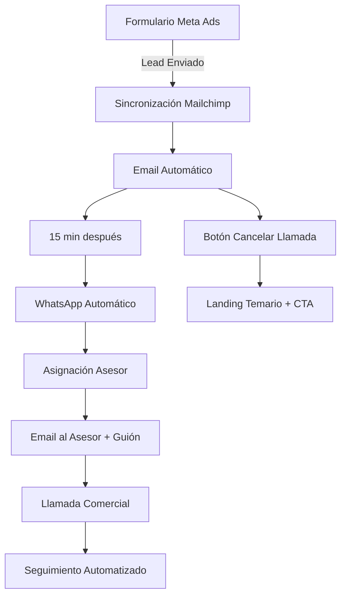

# 🍂 CAMPAÑA META ADS - OTOÑO 2025
## CEP FORMACIÓN - SOLARIA.AGENCY

---

## 🎯 ESTRATEGIA OTOÑO 2025

**Periodo Planificado**: Septiembre - Noviembre 2025  
**Cliente**: CEP FORMACIÓN  
**Agencia**: SOLARIA.AGENCY  
**Plataformas**: Meta Business Suite (Facebook/Instagram Ads)  
**Ámbito Geográfico**: Isla de Tenerife (segmentación por sedes)  
**Objetivo**: Automatización completa del flujo con alta conversión comercial  

### 🚀 OBJETIVOS ESTRATÉGICOS

- **Automatización completa**: Flujo end-to-end sin intervención manual
- **Segmentación geográfica**: CEP NORTE vs CEP SANTA CRUZ
- **Contacto inmediato**: Email + WhatsApp + llamada automatizados
- **Mejora conversión**: Capacitación comercial + guiones estructurados
- **Infraestructura propia**: Dominio `cepcomunicacion.com` operativo

---

## 🧠 LECCIONES APRENDIDAS - PRIMAVERA 2025

### **ÉXITOS A REPLICAR**
✅ **Sistema Flow v4.0**: Procesamiento automatizado funcional  
✅ **Normalización datos**: Sin errores de mapeo/formato  
✅ **Google Sheets integration**: Distribución operadores estable  
✅ **Cobertura Tenerife**: Radio 50km desde centro efectivo  

### **DESAFÍOS A RESOLVER OTOÑO 2025**
🔄 **Proceso manual**: Descarga formularios cada 2-3 días  
🔄 **Retrasos contacto**: Tiempo entre lead y primera llamada  
🔄 **Baja conversión**: Falta capacitación cierre comercial  
🔄 **Sin seguimiento**: Automatización post-contacto inexistente  
🔄 **Single point failure**: Dependencia manual crítica  

---

## 🛠️ ARQUITECTURA TECNOLÓGICA OTOÑO 2025

### **STACK TECNOLÓGICO**
```python
# PLATAFORMAS CORE
✅ Meta Business Suite (Facebook/Instagram Ads)
✅ Mailchimp (Email marketing + automatizaciones)
✅ n8n (Motor de automatización principal)
✅ Google Sheets (Base de registro leads)

# INFRAESTRUCTURA PROPIA
✅ Dominio: cepcomunicacion.com (Solaria)
✅ Email: info@cepcomunicacion.com (DKIM/SPF)
✅ WhatsApp Business API
✅ Aislamiento operativo total de cursostenerife.es
```

### **FLUJO AUTOMATIZADO OTOÑO 2025**



---

## 📈 ESTRUCTURA CAMPAÑA META ADS

### **CAMPAÑA: "CEP FORMACIÓN - OTOÑO 2025"**
- **Objetivo**: Generación de leads
- **Formato creative**: Videos tipo Reels (15 segundos)
- **Estructura**: 1 formulario directo por ad
- **Sin campos adicionales**: Solo email + teléfono autorelleno

### **CONJUNTOS DE ANUNCIOS POR SEDE**

#### **🏔️ CEP NORTE**
- **Segmentación**: Norte de Tenerife  
- **Cursos disponibles**: Según oferta sede norte

#### **🏖️ CEP SANTA CRUZ**  
- **Segmentación**: Santa Cruz + Sur de Tenerife
- **Cursos disponibles**: Según oferta sede sur

### **CREATIVOS VIDEOS (15 SEGUNDOS)**
```bash
0.0s: Imagen emocional de la profesión
1.0s: Inclusión hombre y mujer  
1.5s: Título del curso
3.0s: Logo CEP visible
```

---

## 🤖 AUTOMATIZACIÓN N8N - FLUJO DETALLADO

### **PASO 1: FORMULARIO ENVIADO**
- **Trigger**: Formulario Meta Ads completado
- **Acción**: Sincronización automática con Mailchimp

### **PASO 2: EMAIL AUTOMÁTICO INMEDIATO**  
```
Asunto: ✅ Información recibida - Curso [NOMBRE_CURSO]
Contenido:
- Agradecimiento + información básica
- Aviso de llamada próxima 
- Botón "Cancelar llamada" → Redirige a landing
```

### **PASO 3: WHATSAPP (15 min después)**
- **Origen**: Número oficial CEP
- **Automatización**: n8n o servidor MCP
- **Mensaje**: Confirmación interés + información adicional

### **PASO 4: ASIGNACIÓN ASESOR**
- **Sistema**: Google Sheets compartido
- **Lógica**: Asignación rotativa/distribuida
- **Output**: Email automático al asesor con:
  - Datos del lead completos
  - Guión de contacto estructurado
  - Enlace directo a ficha en Sheet

---

## 📞 GUIÓN COMERCIAL ESTRUCTURADO

### **EMAIL AL ASESOR (TEMPLATE)**
```
Asunto: 🎯 Nuevo lead asignado – Curso [CURSO] en [SEDE]

Hola [Nombre del Asesor],

Tienes un nuevo lead asignado para contactar en las próximas horas.

📌 DETALLES DEL LEAD:
- Nombre: [Nombre del lead]
- Teléfono: [Teléfono del lead]  
- Email: [Email del lead]
- Curso: [Nombre del curso]
- Sede: [CEP NORTE / SANTA CRUZ]
- Formulario enviado: [Fecha y hora]
```

### **GUIÓN TELEFÓNICO SUGERIDO**
```
> Hola, ¿[Nombre del lead]?
> Mi nombre es [Tu nombre], te llamo de parte de CEP Formación. 
> Nos dejaste tus datos para recibir información sobre el curso 
> de [Nombre del curso] en [Sede].
> ¿Tienes un momento para contarte en qué consiste y cómo 
> puedes preinscribirte?

DESARROLLO:
- Reafirmar beneficios clave del curso
- Confirmar disponibilidad y motivación
- Ofrecer envío de temario y link preinscripción
- Preguntar preferencia de contacto (WhatsApp/email)
- Dejar opción abierta de reserva de plaza
```

---

## 🎯 OBJETIVOS CLAVE OTOÑO 2025

### **AUTOMATIZACIÓN**
- ⚡ **Tiempo contacto**: <30 min desde formulario (vs 2-3 días)
- 🔄 **Proceso end-to-end**: 100% automatizado sin intervención manual
- 📊 **Seguimiento**: Registro automático en Google Sheets
- 📧 **Comunicación**: Email + WhatsApp + llamada coordinados

### **CONVERSIÓN COMERCIAL**
- 📞 **Guión estructurado**: Capacitación estandarizada asesores
- 🎯 **Contacto inmediato**: Aprovechar interés inicial del lead
- 📋 **Landing preinscripción**: Opción para leads que cancelan llamada
- 🔄 **Seguimiento automatizado**: Nurturing posterior

### **MÉTRICAS A MEDIR**
- 📈 **Tiempo respuesta**: Lead a primer contacto
- 📞 **Tasa contacto**: % leads contactados exitosamente  
- 💬 **Conversión**: Lead a preinscripción/matrícula
- 🔄 **Seguimiento**: % leads con seguimiento completado

---

## 🛠️ IMPLEMENTACIÓN TECNOLÓGICA

### **ACCIONES PENDIENTES - DESARROLLO**
```bash
✅ Crear plantilla HTML en Mailchimp para email inicial
✅ Diseñar landings:
   - Cancelación de llamada
   - Temario + última oportunidad  
   - Formulario de preinscripción
✅ Generar flujo completo en n8n:
   - Google Sheets + Mailchimp + WhatsApp
✅ Producir videos por curso (1 por sede si aplica)
✅ Confirmar listado final de cursos y fechas
✅ Vincular formularios a listas Mailchimp + flujos
✅ Incluir guión de contacto en emails a asesores
```

### **CONFIGURACIÓN TÉCNICA**
```
📧 Email operativo: info@cepcomunicacion.com
🌐 Dominio: cepcomunicacion.com (propiedad Solaria)
📱 WhatsApp Business API configurado
📊 Google Sheets: MASTER LEADS - OTOÑO 2025
🔗 n8n: Flujos de automatización + logs
📨 Mailchimp: Listas segmentadas + automatizaciones
```

### **PRINCIPIOS OPERATIVOS**
- **Aislamiento total**: Separado de cursostenerife.es
- **Infraestructura propia**: Dominio Solaria operativo
- **Formularios directos**: 1 por ad, sin campos adicionales
- **Segmentación geográfica**: Ads separados por sede
- **Automatización completa**: Sin dependencias manuales

---

## 📋 LANDINGS DE PREINSCRIPCIÓN

### **OBJETIVO**
Confirmar interés del lead antes de llamada y facilitar pre-matriculación.

### **CONTENIDO LANDING**
```
📝 Formulario completo:
- Nombre, apellidos
- Email, teléfono  
- Curso y sede
- Preferencia de contacto
- Opción de reserva de plaza

💬 Mensaje final: 
"Un asesor se pondrá en contacto contigo para finalizar tu matrícula"
```

### **UBICACIÓN ENLACES**
- Email de bienvenida (botón "Cancelar llamada")
- WhatsApp automatizado
- Landings Mailchimp
- Temario + última oportunidad

### **FUTURO: MATRICULACIÓN ONLINE**
**Objetivo estratégico** para implementar:
- Validación de identidad
- Firma digital
- Pasarela de pago (Stripe, Redsys)
- Integración CRM + automatizaciones onboarding

---

## 🎯 OPTIMIZACIÓN Y SEGUIMIENTO

### **GOOGLE SHEETS MASTER LEADS**
```
Columnas nuevas requeridas:
- Asesor asignado
- Fecha de contacto  
- Estado de matrícula
- Guión utilizado (sí/no/observaciones)
- Seguimiento automatizado
```

### **MAILCHIMP SEGMENTACIÓN**
```
Etiquetas de segmentación:
- Pre-inscrito
- Matriculado  
- Sin respuesta
- Canceló llamada
- Seguimiento activo
```

### **N8N CONTROL Y LOGS**
```
- Control de errores automatizado
- Logging de WhatsApp + emails + asignaciones
- Automatización de tareas con cron y webhooks  
- Fallback systems para fallos críticos
- Notificaciones de sistema a Solaria
```

### **OBJETIVOS SECUNDARIOS**
- ✅ Aumentar tasa conversión formulario (-fricción)
- ✅ Captar leads calidad segmentados por zona  
- ✅ Recuperar leads indecisos sin llamada
- ✅ Disminuir abandono post-contacto
- ✅ Confirmar interés real via landing preinscripción
- ✅ Facilitar cierre matrícula plataforma propia
- ✅ Estandarizar guión comercial asesores

---

## 📋 CHECKLIST PRE-LANZAMIENTO

### **TECNOLOGÍA**
- [ ] Sistema v5.0 desarrollado y testado
- [ ] IA Lead Scoring calibrado con datos primavera
- [ ] Dashboard tiempo real operativo
- [ ] Integraciones nuevos canales funcionando
- [ ] WhatsApp Business API configurado
- [ ] Webhooks tiempo real implementados

### **CREATIVE & CONTENIDO**
- [ ] Video assets multi-formato producidos
- [ ] Copy personalizado por canal/audiencia
- [ ] Landing pages optimizadas mobile-first
- [ ] A/B testing matrix definida
- [ ] Secuencias email nurturing configuradas

### **OPERACIONES**
- [ ] Equipo comercial formado en nuevos procesos
- [ ] Procedimientos escalado rápido documentados
- [ ] Alertas y monitoreo 24/7 configurado
- [ ] Backup systems y contingencia preparados
- [ ] KPIs y reporting automático funcionando

---

## 🎯 CONCLUSIÓN ESTRATÉGICA

La **Campaña Otoño 2025** representa la evolución natural de los éxitos conseguidos en primavera. Con una base tecnológica sólida (Flow v4.0), learnings comerciales validados, y la incorporación de IA predictiva, estamos posicionados para:

✅ **Duplicar resultados** manteniendo calidad  
✅ **Innovar tecnológicamente** con IA/ML  
✅ **Expandir geográficamente** de forma controlada  
✅ **Diversificar canales** reduciendo dependencia  
✅ **Optimizar ROI** mediante automatización avanzada  

---

## 📞 PRÓXIMOS PASOS

**Desarrollado por**: SOLARIA.AGENCY  
**Planificación**: Julio-Agosto 2025  
**Lanzamiento**: Septiembre 2025  
**Cliente**: CEP FORMACIÓN  
**Estado**: 🚀 **LISTO PARA IMPLEMENTAR**  

### **CONTACTO DE ACTIVACIÓN**
Para proceder con la implementación de esta estrategia, contactar:
- **Estrategia**: SOLARIA.AGENCY
- **Desarrollo**: Equipo técnico v5.0  
- **Lanzamiento**: Septiembre 1, 2025

---

*Esta estrategia está respaldada por datos reales de la campaña primavera 2025 y representa el siguiente nivel evolutivo del proyecto CEP FORMACIÓN.*

**#SolariaAgency #CEPFormacion #Otoño2025 #IA #Escalabilidad #MetaAds** 