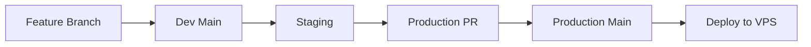

# 🚀 Estrategia CI/CD - SOLARIA CEP Comunicación

## 📋 Resumen Ejecutivo

Esta documentación describe la estrategia completa de CI/CD implementada para el desarrollo y despliegue de la plataforma CEP Comunicación, siguiendo las mejores prácticas de DevOps y garantizando calidad, seguridad y eficiencia en cada release.

## 🏗️ Arquitectura de Repositorios

### Repositorio de Desarrollo: `solaria-cepcomunicacion-dev`
- **Propósito**: Desarrollo activo, nuevas features, fixes y optimizaciones
- **Ramas principales**:
  - `main`: Desarrollo continuo y integración
  - `staging`: Pre-producción para testing integral
  - `feature/*`: Ramas de características específicas
  - `hotfix/*`: Fixes críticos

### Repositorio de Producción: `solaria-cepcomunicacion`
- **Propósito**: Código estable para producción
- **Rama principal**:
  - `main`: Únicamente código aprobado y testeado
- **Protecciones**: Branch protection rules, required reviews

## 🔄 Flujo de Trabajo (GitFlow)



### 1. Desarrollo de Features
```bash
# Crear nueva feature
git checkout -b feature/nueva-funcionalidad
# Desarrollo y commits
git commit -m "feat: implementar nueva funcionalidad"
# Push y PR a main
git push origin feature/nueva-funcionalidad
```

### 2. Integración a Staging
```bash
# Merge a staging para testing integral
git checkout staging
git merge main
git push origin staging
```

### 3. Sincronización a Producción
- **Automático**: Tras deployment exitoso en staging
- **Manual**: Via workflow dispatch para releases de emergencia

## 🛠️ Pipelines CI/CD

### Pipeline 1: Development CI (`dev-ci.yml`)
**Trigger**: Push a `main` o `staging`, PRs a `main`

**Etapas**:
1. **Testing Matrix**: Node.js 18.x y 20.x
2. **Quality Gates**:
   - Linting (ESLint)
   - Type checking (TypeScript)
   - Unit tests (Vitest) con coverage
   - Security audit (npm audit)
3. **Build Validation**: Compilación exitosa
4. **Performance Testing**: Lighthouse CI

**Criterios de Éxito**:
- ✅ Todos los tests pasan
- ✅ Coverage > 80%
- ✅ Performance score > 85
- ✅ Accessibility score > 95
- ✅ No vulnerabilidades críticas

### Pipeline 2: Staging Deployment (`staging-deploy.yml`)
**Trigger**: Push a `staging` + CI exitoso

**Etapas**:
1. **Build para Staging**: Variables de entorno específicas
2. **Deploy a Servidor**: SSH deployment a staging.cepformacion.com
3. **Health Checks**: Validación de endpoints
4. **E2E Testing**: Tests críticos en staging

**Entorno de Staging**:
- **URL**: https://staging.cepformacion.com
- **Propósito**: QA testing, validación visual
- **Datos**: Dataset de prueba

### Pipeline 3: Production Sync (`prod-sync.yml`)
**Trigger**: Staging deployment exitoso

**Proceso**:
1. **Crear Branch de Sync**: `sync/staging-to-prod-TIMESTAMP`
2. **Generar PR Automático**: Con changelog y checklist
3. **Asignar Reviewers**: Para aprobación manual
4. **Notificaciones**: Slack/Discord alerts

**PR Template Automático**:
```markdown
## 🚀 Production Release - YYYY-MM-DD

### ✅ Pre-deployment validations:
- [x] All tests passed in development
- [x] Staging deployment successful
- [x] E2E tests passed on staging
- [x] Performance metrics validated

### 🔍 Manual QA Required:
- [ ] Visual regression testing
- [ ] Cross-browser compatibility
- [ ] Mobile responsiveness
- [ ] Form functionality validation
```

## 🧪 Estrategia de Testing

### Testing Pyramid

```
    /\     E2E Tests (Playwright)
   /  \    - Critical user paths
  /____\   - Cross-browser testing
 /      \  Integration Tests (Vitest)
/        \ - Component integration
\________/ Unit Tests (Vitest)
           - Individual functions
           - Component logic
```

### Tipos de Tests

1. **Unit Tests** (Vitest)
   - Componentes individuales
   - Funciones utilitarias
   - Hooks personalizados
   - Target: 80% coverage

2. **Integration Tests** (Vitest)
   - Interacción entre componentes
   - API calls y responses
   - Form submissions

3. **E2E Tests** (Playwright)
   - Flujos críticos de usuario
   - Cross-browser compatibility
   - Mobile responsiveness
   - Performance validation

4. **Performance Tests** (Lighthouse CI)
   - Core Web Vitals
   - Accessibility compliance
   - SEO optimization
   - Best practices

### Quality Gates

| Métrica | Threshold | Acción si Falla |
|---------|-----------|------------------|
| Test Coverage | > 80% | ❌ Block merge |
| Performance Score | > 85 | ❌ Block merge |
| Accessibility | > 95 | ❌ Block merge |
| Security Vulnerabilities | 0 Critical | ❌ Block merge |
| Build Success | 100% | ❌ Block merge |

## 🚀 Estrategia de Deployment

### Entornos

1. **Local Development**
   - `npm run dev`
   - Hot reload
   - Debug tools

2. **Staging Environment**
   - **URL**: staging.cepformacion.com
   - **Propósito**: QA testing
   - **Deploy**: Automático desde `staging`
   - **Datos**: Test dataset

3. **Production Environment**
   - **URL**: cepformacion.com
   - **Deploy**: Manual approval required
   - **Strategy**: Blue-Green deployment
   - **Rollback**: One-click rollback

### Blue-Green Deployment

```bash
# Preparar nuevo release (Green)
sudo mkdir -p /var/www/cepformacion.com-green
cd /var/www/cepformacion.com-green
git clone --branch main https://github.com/SOLARIA-AGENCY/solaria-cepcomunicacion.git .
npm ci --production
npm run build

# Health checks en Green
curl -f http://localhost:3001/health

# Switch traffic (Blue -> Green)
sudo ln -sfn /var/www/cepformacion.com-green /var/www/cepformacion.com-current
sudo systemctl reload nginx

# Verificar producción
curl -f https://cepformacion.com/health

# Cleanup old Blue
sudo rm -rf /var/www/cepformacion.com-blue
```

## 🔧 Configuración de Secrets

### GitHub Secrets Requeridos

#### Repositorio Dev:
```bash
STAGING_HOST=staging.cepformacion.com
STAGING_USER=deploy
STAGING_SSH_KEY=<private_key>
PROD_SYNC_TOKEN=<github_token>
```

#### Repositorio Producción:
```bash
PROD_HOST=cepformacion.com
PROD_USER=deploy
PROD_SSH_KEY=<private_key>
SLACK_WEBHOOK=<webhook_url>
```

## 📊 Monitoreo y Alertas

### Health Checks
```bash
# Endpoint de salud
GET /health
{
  "status": "healthy",
  "timestamp": "2024-01-15T10:30:00Z",
  "version": "1.2.3",
  "environment": "production"
}
```

### Métricas Monitoreadas
- **Uptime**: 99.9% SLA
- **Response Time**: < 2s promedio
- **Error Rate**: < 0.1%
- **Core Web Vitals**: LCP < 2.5s, FID < 100ms, CLS < 0.1

### Alertas Automáticas
- ❌ Deployment failures
- ⚠️ Performance degradation
- 🔒 Security vulnerabilities
- 📈 Traffic spikes

## 🔄 Rollback Strategy

### Rollback Automático
```yaml
# En caso de health check failure
if: health_check_failed
run: |
  echo "Health check failed, initiating rollback"
  sudo ln -sfn /var/www/cepformacion.com-blue /var/www/cepformacion.com-current
  sudo systemctl reload nginx
```

### Rollback Manual
```bash
# Rollback a versión específica
git tag --list | grep v1
git checkout v1.2.2
npm ci --production
npm run build
# Deploy rollback version
```

### Database Rollback
```bash
# Backup automático pre-deployment
pg_dump cep_production > backup_$(date +%Y%m%d_%H%M%S).sql

# Rollback si es necesario
psql cep_production < backup_20240115_103000.sql
```

## 📅 Timeline de Implementación

### Fase 1: Setup Básico (Semana 1)
- [x] Configurar GitHub Actions workflows
- [x] Implementar quality gates
- [x] Setup staging environment
- [x] Configurar branch protection rules

### Fase 2: Testing Automation (Semana 2)
- [x] Implementar E2E tests con Playwright
- [x] Configurar Lighthouse CI
- [x] Setup coverage reporting
- [x] Integrar security scanning

### Fase 3: Production Pipeline (Semana 3)
- [ ] Configurar production deployment
- [ ] Implementar blue-green deployment
- [ ] Setup monitoring y alertas
- [ ] Configurar rollback automático

### Fase 4: Optimización (Semana 4)
- [ ] Fine-tuning de performance
- [ ] Documentación completa
- [ ] Training del equipo
- [ ] Validación end-to-end

## 🎯 Beneficios Esperados

### Para el Desarrollo
- ⚡ **Faster Time to Market**: Deployments automáticos
- 🛡️ **Higher Quality**: Quality gates automáticos
- 🔄 **Reduced Risk**: Testing exhaustivo pre-producción
- 📊 **Better Visibility**: Métricas y monitoring continuo

### Para el Negocio
- 💰 **Reduced Costs**: Menos tiempo en debugging
- 📈 **Better Performance**: Optimización continua
- 🎯 **Higher Reliability**: 99.9% uptime SLA
- 🚀 **Competitive Advantage**: Releases más frecuentes

## 📞 Contacto y Soporte

**ECO-NAZCAMEDIA DevOps Team**
- 📧 Email: devops@solaria.agency
- 🔧 Emergency: Slack #devops-alerts
- 📚 Documentation: /docs/
- 🎫 Issues: GitHub Issues

---

*Documentación generada por ECO-NAZCAMEDIA CI/CD Pipeline*  
*Última actualización: 2024-01-15*