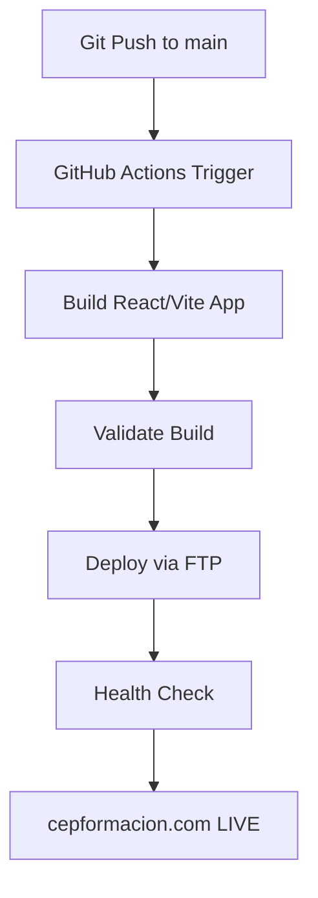

# Guía de Configuración CEP Formación
## Gestión Manual + Automatización Hostinger

---

## 🚨 CONFIGURACIÓN INICIAL REQUERIDA (MANUAL)

### 1. Obtener Credenciales FTP desde Hostinger

```bash
1. Login a hPanel: https://hpanel.hostinger.com
2. Navegar a: Files → FTP Accounts  
3. Anotar credenciales:
   - Host: ftp.hostinger.com
   - Username: u[número]
   - Password: [generar si es necesario]
   - Port: 21
```

### 2. Configurar Secrets en GitHub

```bash
# En GitHub Repository
Settings → Secrets and variables → Actions → New repository secret

HOSTINGER_FTP_USERNAME = u123456789
HOSTINGER_FTP_PASSWORD = tu_password_ftp
```

### 3. Verificar Estructura de Directorio

```
hostinger/
└── public_html/
    ├── index.html (tu sitio)
    ├── assets/
    └── .htaccess (auto-generado)
```

---

## 🔧 GESTIÓN DNS (MANUAL OBLIGATORIO)

### Acceso a DNS Management
```bash
hPanel → Advanced → DNS Zone Editor
```

### Records Típicos para cepformacion.com
```dns
# A Record (Principal)
Type: A
Name: @
Points to: [IP de Hostinger - automático]
TTL: 14400

# WWW Redirect
Type: CNAME  
Name: www
Points to: cepformacion.com
TTL: 14400

# Subdominios (si necesarios)
Type: CNAME
Name: admin
Points to: cepformacion.com
TTL: 14400
```

---

## 🚀 WORKFLOW DE DESPLIEGUE AUTOMATIZADO

### Flujo Completo


### Comandos de Activación
```bash
# Despliegue automático
git add .
git commit -m "Deploy to production"
git push origin main

# Despliegue manual (desde GitHub)
Actions → Deploy CEP Formación → Run workflow
```

---

## 📊 MONITOREO Y GESTIÓN

### Health Check Manual
```bash
# Verificar estado del sitio
curl -I https://cepformacion.com

# Verificar certificado SSL
curl -vI https://cepformacion.com 2>&1 | grep -i ssl
```

### Logs de Despliegue
```bash
# En GitHub
Actions → Workflow runs → Ver detalles

# Logs disponibles:
- Build logs
- FTP upload logs  
- Health check results
```

---

## 🔒 GESTIÓN DE ARCHIVOS HOSTINGER

### Via File Manager (Manual)
```bash
1. hPanel → Files → File Manager
2. Navegar a public_html/
3. Upload, Edit, Delete archivos
4. Extract compressed files
```

### Via FTP (Recomendado)
```bash
# Usando FileZilla
Host: ftp.hostinger.com
Username: [tu FTP username]  
Password: [tu FTP password]
Port: 21

# O via terminal
sftp username@ftp.hostinger.com
cd public_html
put -r dist/* .
```

---

## 🛠 CONFIGURACIÓN AVANZADA

### Optimización .htaccess
```apache
# En public_html/.htaccess (auto-generado por Hostinger)
RewriteEngine On

# Redirects para SPA
RewriteCond %{REQUEST_FILENAME} !-f
RewriteCond %{REQUEST_FILENAME} !-d
RewriteRule ^(.*)$ index.html [L]

# Cache headers
<IfModule mod_expires.c>
    ExpiresActive on
    ExpiresByType text/css "access plus 1 year"
    ExpiresByType application/javascript "access plus 1 year"
    ExpiresByType image/png "access plus 1 year"
    ExpiresByType image/jpg "access plus 1 year"
    ExpiresByType image/jpeg "access plus 1 year"
    ExpiresByType image/gif "access plus 1 year"
    ExpiresByType image/svg+xml "access plus 1 year"
</IfModule>

# Compression
<IfModule mod_deflate.c>
    AddOutputFilterByType DEFLATE text/plain
    AddOutputFilterByType DEFLATE text/html
    AddOutputFilterByType DEFLATE text/xml
    AddOutputFilterByType DEFLATE text/css
    AddOutputFilterByType DEFLATE application/xml
    AddOutputFilterByType DEFLATE application/xhtml+xml
    AddOutputFilterByType DEFLATE application/rss+xml
    AddOutputFilterByType DEFLATE application/javascript
    AddOutputFilterByType DEFLATE application/x-javascript
</IfModule>
```

### Variables de Entorno Build
```javascript
// vite.config.js - Optimización para Hostinger
export default {
  base: '/',
  build: {
    outDir: 'dist',
    assetsDir: 'assets',
    minify: 'terser',
    rollupOptions: {
      output: {
        manualChunks: {
          vendor: ['react', 'react-dom']
        }
      }
    }
  },
  server: {
    host: true, // Para testing local
    port: 3000
  }
}
```

---

## 🐛 TROUBLESHOOTING COMÚN

### Problema: 403 Forbidden
```bash
# Solución: Verificar permisos
Folders: 755
Files: 644

# En hPanel: Files → Fix File Ownership → Execute
```

### Problema: Sitio no actualiza
```bash
# Soluciones:
1. Clear browser cache
2. Verificar que FTP upload completó
3. Check .htaccess syntax
4. Verificar que index.html existe en public_html/
```

### Problema: CSS/JS no cargan
```bash
# Verificar rutas en build
# En dist/index.html debe ser:
<link rel="stylesheet" href="/assets/style.css">
<script src="/assets/main.js"></script>

# NO debe tener rutas absolutas externas
```

---

## 🎯 CHECKLIST DE CONFIGURACIÓN

### Setup Inicial ✅
- [ ] Credenciales FTP obtenidas
- [ ] GitHub Secrets configurados  
- [ ] Workflow file creado
- [ ] DNS records verificados

### Pre-Deployment ✅
- [ ] Build local exitoso
- [ ] Archivos en dist/ verificados
- [ ] .htaccess configurado
- [ ] SSL certificado activo

### Post-Deployment ✅
- [ ] Site responds 200 OK
- [ ] CSS/JS loading correctly
- [ ] Forms working (si aplica)
- [ ] Mobile responsive check

---

## 📞 SOPORTE DE EMERGENCIA

### Hostinger Support
```
- Live Chat: desde hPanel
- Email: support@hostinger.com  
- Knowledgebase: support.hostinger.com
```

### Rollback de Emergencia
```bash
# Via FTP - restaurar backup
sftp username@ftp.hostinger.com
cd public_html
put -r backup_files/* .

# Via hPanel - restore from backup
Files → Backups → Restore
```

---

## 🚀 PRÓXIMOS PASOS RECOMENDADOS

### Inmediato
1. Configurar credenciales FTP
2. Activar workflow de despliegue
3. Realizar primer deploy de prueba

### Medio Plazo  
1. Configurar monitoring automático
2. Setup backup automático
3. Implementar staging environment

### Largo Plazo
1. Evaluar migración a VPS (si se requiere API)
2. Implementar CDN optimizado
3. Monitoring avanzado con alertas

---

**🎯 RESULTADO ESPERADO**: Despliegue automático cada push a main, gestión manual solo para DNS y configuraciones iniciales.

---

*Guía preparada por SOLARIA.AGENCY-ECO*  
*Validado por NAZCAMEDIA-Δ* 